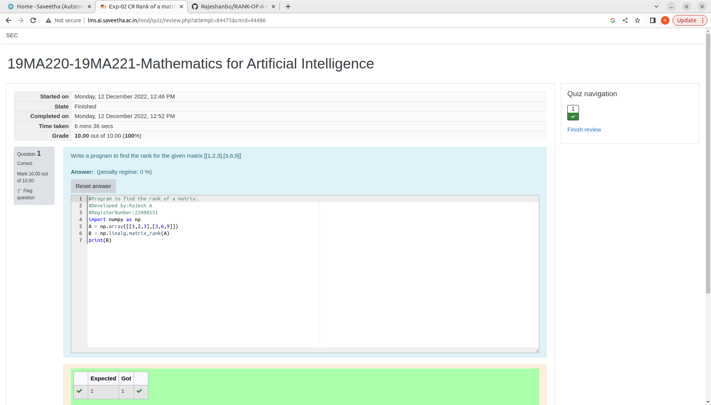

# RANK-OF-A-MATRIX
## Aim:
To write a python program to find the rank of a matrix
## Equipment’s required:
1. 	Hardware – PCs
2. 	Anaconda – Python 3.7 Installation / Moodle-Code Runner
## Algorithm:
### Step 1: 
import numpy  
### Step 2:
Get the input matrix

### Step 3: 
Using the np.linalg.matrix_rank(), we can find the rank of the given matrix.
### Step 4: 
end the program
## Program:
```
#Program to find the rank of a matrix.
#Developed by:Rajesh A  
#RegisterNumber:22008551
import numpy as np
A = np.array([[1,2,3],[3,6,9]])
B = np.linalg.matrix_rank(A)
print(B)

```
## Output:



## Result:
Thus the rank for the given matrix is successfully solved by  using a python program.

